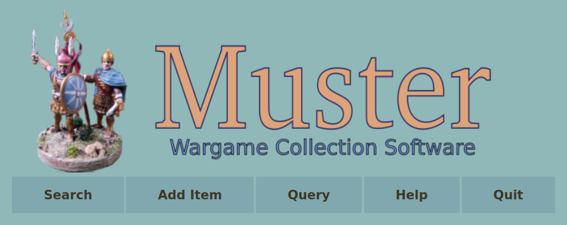
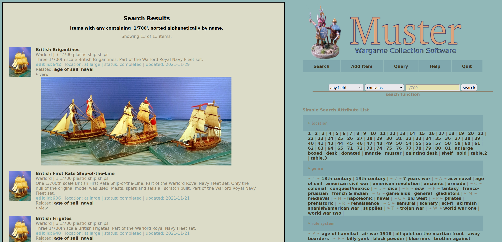

# Muster

Muster is a collections management system designed for table-top miniature gaming. While Muster is browser based, it runs entirely on your computer and keeps all your data locally in YAML--a text based format.

Muster is written in the Ruby programming language which must be installed and configured on your computer for Muster to run. Details on installing Ruby can be found at Ruby-lang.org. Muster uses the Webrick web server which up until Ruby version 3.0 was part of the Ruby core distribution. With Ruby 3.0, the Webrick Gem must be specifically installed. Muster also depends upon the YAML gem, though at the time of this writing that is still part of the Ruby Core Distribution. Muster is platform agnostic. As long as you have Ruby and Webrick running on your system, Muster should run just fine.

Muster is designed as a single user application. While it does incorporate a web server, it does not perform a lot of input data validation. For this reason it should be protected behind your computer's firewall.

The various fields in Muster are intentionally generic providing flexibility in cataloging many different types of gaming collections. It incorporates a tagging system to create relationships between items that don't quite fit into the pre-defined field schema. Muster allows you to upload electronic versions of rules and documents and catalog them along with the rest of your collection. No more trying to find which folder you stored them in!

Simple single-field searches are easily accessible from the main menu and a more flexible (though slightly more complex) querying system is also available. The Query system allows you to define reports and run them repeatedly. You can perform bulk updates on multiple items through the query system.

### Muster Data fields:

- **name** (required): This is the short primary descriptor of the item.

- **description**: A detailed description of the item.

- **id**: This is a system assigned numeric identifier, it is not editable by the user.

- **genre** (highly suggested): A single broad grouping of items, often of time periods or campaign theatres.

- **tags**: A list of related subject areas or concepts. Multiple values can be entered by separating the tags with commas.

- **qty**: The number of items covered by this record.

- **category** (highly suggested): A more specific grouping, e.g., figures, rules, ships, etc.

- **material**: The material the item is made from, metal, plastic, composite, etc.

- **location**: Where is the item stored?

- **project/rules system**: What rules are used for this item? Or, what project does it belong to?

- **figures/manufacturer**: Who made or produced the item?

- **figures/scale**: The scale (1/56) or size (15mm) of the figure.

- **figures/type**: Infantry, cavalry, artillery, etc.

- **figures/status**: NIP (New in Box), in process, primed, based, completed, etc.

- **finish/qty**: Quantity of bases of items (could be the same as previous quantity).

- **finish/base size**: 1x1 inch, Round-25mm, etc, the size of the base.

- **finish/painter**: Who painted this item?

- **finish/completed date**: When was the item completed.

- **images/icon**: A small image to represent this item--should be 70 pixels wide and 100 pixels high for display on the item and search pages. Could be shared with related class of items. Icon images cannot be deleted in Muster because they may be used by multiple items. They can be manually deleted from the muster/application_images folder.

- **images/item image**: A larger image of the specific item. Multiple images can be uploaded but not all at the same time. Upload one image, save the item, edit it again to upload the second image, etc. individual images can be deleted in this section by clicking the 'delete' box beneath the image and then saving the item.

- **valuation/cost**: What did you pay to purchase the item?

- **valuation/value**: How much would you want to sell this item?

- **valuation/acquired date**: Date on which you acquired this item.

- **links/web review/source**: Supply an internet url for the item (for example to the seller's web site) or, if cataloging an electronic document you can load it into Muster here.

- **links/notes**: Random notes about the item.

- **delete**: To delete the item from Muster, click the 'enable' check box and then click on the 'delete' button. This will delete the record of the item but uploaded pictures, icons or electronic documents will remain in the Muster folders.

